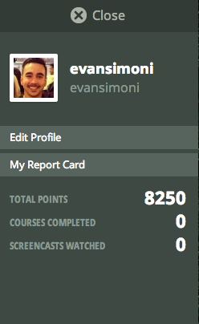

#### Include an inline screenshot of your codeschool's points from the profile page:

<!-- Modify the Markdown to include your answers. Don't delete the questions! -->

##QUIZ
* Explain which tabs support the following actions and how.
  * Realtime editing of HTML and CSS 
  * Javascript Debugging
  * Performance Optimization 

The Elements and Sources tab support realtime editing of HTML and CSS. Within the Element tab you need to control-click to enable editing. On the Sources page editing is enabled by default. Javascript debugging is made possible by the Sources panel. It lets you pause, resume, and step through code. Performance optimization is made pssible by the Network and PageSpeed tab. The Network tab displays a table and graph overview of the elements being loaded by the page. The PageSpeed tab analyzes the elements, figures out where improvement can be made and offers suggestions on how to fix them.

* What's the quick key for your OS to spawn the Dev Tools inspector?

As far as I know this can be done quickly by a control-click or by pressing Cmd + Opt + I.

* Go to http://www.postmachina.com/ and analyze and tweak this nicely designed page.
  * What is the current background color for the page?  (Surprisingly, it's not just black!)
  * Tweak the background color to white.
  * Tweak the height of the side bar that contains the logo.  Shrink it down to 85px.
  * Roll over the navigation links.  When you hover over them, they dissapear.  Let's change the hover color to black instead.
  * Now take a screenshot of your new (and maybe not so improved) design.  It should match this screenshot: http://postimg.org/image/5ak1jkpl5/
  * Upload your own image to the imgs directory in the `1_Chrome_Dev_Tools` directory.  It should match the image above. The last nav link in the image above is black because the mouse was hovering there when the screenshot was taken. Do the same, and don't take a screenshot of your whole desktop, just the browser window. (This is part of the challenge.)

* For the postmachina website, why can't you tweak the color of the text "The most important things are not things"?  Please explain.

I can't figure out why I'm unable to tweak this text. I'll puzzle over it and come back to edit this file if I figure it out.

* Go to www.ticketswizard.com and analyze the page.  
  * What is the largest image on the website? 
  * Explain how you would find out this information, and list the URL of offending image here and how big it is.

I couldn't confirm what the largest image on the site is. I used the search function to go through all of the .png files in the html and it appears that the background is made of an image. However, some images actually showed themselves and their dimensions when I moused over them in dev tools, which is why I'm not sure. I'll come back to this challenge and change my answer if I figure out a better way answer. **UPDATE** I remembered I could sort the loaded items on the Network tab. The largest image is a photo of Times Square (316 kb). For some reason I was thinking I should be looking for the largest photo by pixel dimensions...! I guess that's why it's important to take a break and come back to stuff. :)

* Test the www.ticketswizard.com website with google's [PageSpeed Insights](http://www.ticketswizard.com/).  (You can also download the chrome plugin).  What is the easiest thing to change to optimize the website?  How many kilobytes of data can be eliminated?

It looks to me like the easiest thing to change to optimize the website is the images. I am being told that their size can be reduced by 885.9KiB (a 39% reduction).

